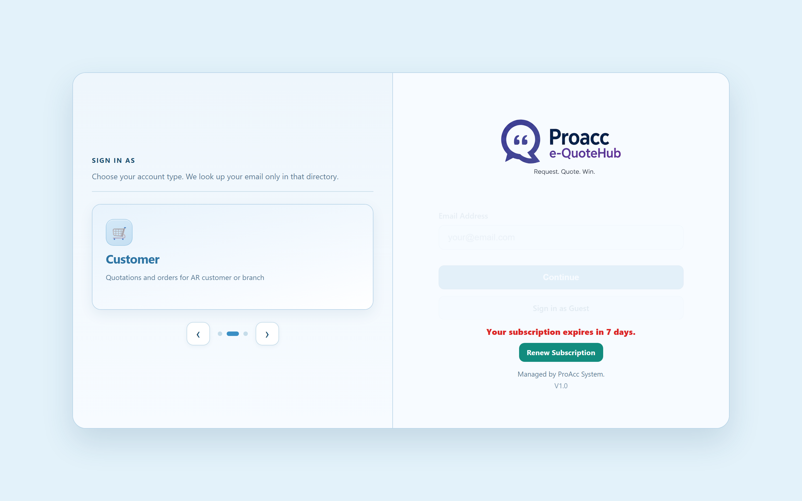
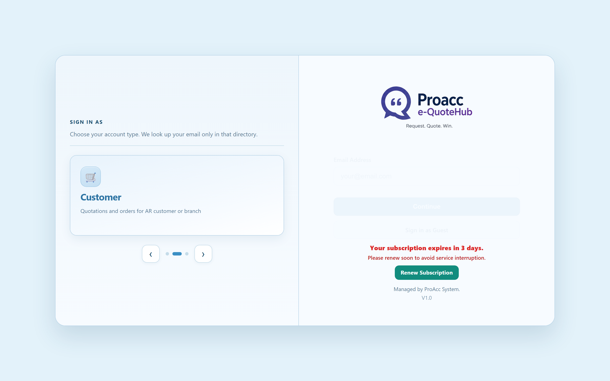
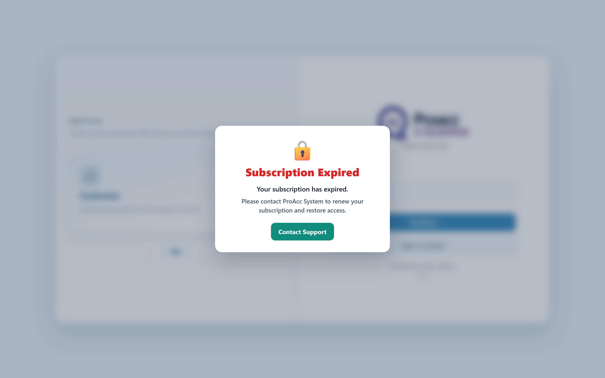

# Tenant subscription expiry

Use this when adding a new ProAcc app, or when changing a tenant’s subscription date. Source of truth is DynamoDB **`TENANT_CONFIG`**, not a local JSON file.

Reference implementation: **eQuotation** (`TNT10004`).

User-facing wording is **Subscription**, not License. Internal field names can stay `license.*`.

---

## What the user sees

Login page only. Do **not** show countdown or lock overlay inside procurement / admin modules after login.

| When | Where | What the user sees |
|------|--------|--------------------|
| More than 10 days until expiry | Login | Nothing extra |
| **10 … 1 days left** | **Login only** | Red countdown copy + **Renew Subscription** (WhatsApp) |
| **Expired** (today or later) | **Login only** | Whole screen **blurred**. Center card: 🔒 **Subscription Expired**, contact copy, **Contact Support** (WhatsApp). Login form cannot be used. |
| Inside the app (after login) | Modules / headers | **No** expiry banner |

### Countdown copy (10 … 1 days)

| Days left | Title | Supporting line | Button |
|-----------|-------|-----------------|--------|
| 10, 9, 8, 6, 5, 4, 2 | Subscription expires in N days | Please renew your subscription to avoid service interruption. | **Renew Subscription** |
| 7 | Your subscription expires in 7 days. | (none) | **Renew Subscription** |
| 3 | Your subscription expires in 3 days. | Please renew soon to avoid service interruption. | **Renew Subscription** |
| 1 | Your subscription expires tomorrow. | Please renew to maintain uninterrupted access. | **Renew Subscription** |

### Expired overlay

```text
🔒 Subscription Expired
Your subscription has expired.
Please contact ProAcc System to renew your subscription and restore access.
[Contact Support]
```

### Screenshots (login)

**7 days**



**3 days**



**1 day**


**Expired**



---

## WhatsApp buttons

Both buttons open WhatsApp (`https://wa.me/<digits>?text=...`).

| Screen | Button | Opens |
|--------|--------|--------|
| Countdown (10 … 1 days) | **Renew Subscription** | WhatsApp |
| Expired overlay | **Contact Support** | WhatsApp |

Pre-filled message:

```text
Hi ProAcc System, I would like to renew my eQuoteHub subscription.
```

### Number

eQuotation `appsettings.json`:

```json
"Support": {
  "WhatsAppNumber": "60183977796"
}
```

- Display / local form: **018-397 7796**
- `wa.me` form: **60183977796**
- Override with env `SUPPORT_WHATSAPP_NUMBER` if needed
- Local `01x` numbers are converted to `60x`
- If the number is empty, the buttons are hidden

Change the number in `appsettings.json` (repo **and** `C:\Apps\eQuotation`), then restart the service.

---

## DynamoDB (`TENANT_CONFIG`, region `ap-southeast-1`)

Partition key: `tenantCode` (example: `TNT10004`).

```json
"license": {
  "expiryDate": "2027-08-14",
  "licenseStatus": "ACTIVE",
  "maxUsers": "5",
  "maxDevices": "3"
}
```

- App reads **`license.expiryDate`** (`YYYY-MM-DD`).
- DynamoDB **TTL is OFF**. This date does **not** delete the tenant row. It is only for the UI / subscription check.
- Change the date in AWS → the running app picks it up on **startup** or on the **24h refresh**. Restart to see it immediately.

### TNT10004 dates

| Role | Date |
|------|------|
| **Real / restore** expiry | `2027-08-14` |
| Test countdown (10 days left, if today is 2026-08-14) | `2026-08-24` |
| Test expired overlay | `2026-08-04` |

Always write down the real `expiryDate` before testing. Restore to **`2027-08-14`** when done.

---

## AWS JSON refresh (DB link, expiry date, etc.)

1. **On service start:** fetch tenant JSON from the tenant-config API (same as ProAccScanner `TenantBootstrap:AwsApiBaseUrl`).
2. **Then every 24 hours:** background worker re-fetches the same JSON and re-applies env (DB host/path, SQL API, `license.expiryDate`, …).

**Not 08:00.** The 24h timer starts when the **Windows service starts**.  
Example: restart at 15:00 → next refresh ~15:00 the next day.

Config (eQuotation):

- `TenantBootstrap.ConfigRefreshSeconds` in `appsettings.json` (default **86400**)
- or env `TENANT_BOOTSTRAP_REFRESH_SECONDS`
- set **`0`** to disable the worker (startup fetch still runs)

Tenant-config API:

```text
https://v2wwsho311.execute-api.ap-southeast-1.amazonaws.com/default/proacc-tenant-config-api?tenantCode=TNT10004
```

OpenAI is **not** required for eQuotation procurement. Do not point `openai.openaiApiKeySecretRef` at `proacc/shared/openai` unless the product actually uses chat/GPT.

---

## Live eQuotation

| Item | Value |
|------|--------|
| Public login | https://equotehub.oneclickclouds.com/login |
| Local login | http://127.0.0.1:8880/login |
| Service | `ProAcc_eQuotation` (NSSM) |
| Live files | `C:\Apps\eQuotation` |
| Error log | `C:\Apps\eQuotation\service-error.log` |
| Output log | `C:\Apps\eQuotation\service-output.log` |

After changing Dynamo or Python/templates:

1. Copy changed files to `C:\Apps\eQuotation` if you edited the repo.
2. Restart: `nssm restart ProAcc_eQuotation` (needs admin).
3. Hard-refresh `/login`.

If `/login` refuses to connect, check `service-error.log`.

---

## Change expiry (AWS)

Write these JSON files **without BOM**, then run `update-item`.

`key.json`:

```json
{"tenantCode":{"S":"TNT10004"}}
```

`names.json`:

```json
{"#lic":"license","#exp":"expiryDate"}
```

`values.json` (put the date you want):

```json
{":d":{"S":"2026-08-04"}}
```

```powershell
aws dynamodb update-item --region ap-southeast-1 --table-name TENANT_CONFIG `
  --key file://key.json `
  --update-expression "SET #lic.#exp = :d" `
  --expression-attribute-names file://names.json `
  --expression-attribute-values file://values.json
```

Then **restart** `ProAcc_eQuotation` (or wait 24h).

### Test A — countdown (10 days left)

Set expiry = today + 10 days. Example if today is 2026-08-14 → `2026-08-24`.

Hard-refresh `/login`. Expect red countdown + **Renew Subscription**.

### Test B — expired overlay + WhatsApp

Set expiry = today − 10 days. Example → `2026-08-04`.

Hard-refresh `/login`. Expect lock overlay + **Contact Support** → WhatsApp.

### Restore TNT10004

Set `values.json` to:

```json
{":d":{"S":"2027-08-14"}}
```

Run the same `update-item`, then restart `ProAcc_eQuotation`. Login should look normal again (no countdown, no lock).

---

## Porting to a new project (checklist)

1. Fetch tenant JSON on startup (existing tenant bootstrap).
2. Parse `license.expiryDate` into memory (`TENANT_LICENSE_EXPIRY`).
3. Start a daemon loop: sleep 86400s, then fetch again and resync DB config.
4. Login page only:
   - if `1 <= days_left <= 10` → subscription countdown copy + **Renew Subscription** (WhatsApp)
   - if `days_left <= 0` → full-screen blur + 🔒 + **Subscription Expired** + **Contact Support** (WhatsApp)
5. Do not show this inside logged-in modules.
6. Add `Support.WhatsAppNumber` in `appsettings.json`.
7. OpenAI is **not** required unless the product actually uses chat/GPT.

### eQuotation files to copy / mirror

| Piece | Path |
|-------|------|
| Fetch + snapshot + 24h worker + copy + WhatsApp URL | `utils/tenant_bootstrap.py` (`apply_tenant_env_overrides`, `license_banner_context`, `build_support_whatsapp_url`, `start_tenant_config_refresh_worker`) |
| Start worker | `main.py` and `api/app.py` after bootstrap |
| Jinja flags | Flask `@app.context_processor` → `license_banner_show`, `license_expired`, `license_banner_title`, `license_banner_body`, `license_banner_detail`, `support_whatsapp_url` |
| WhatsApp number | `appsettings.json` → `Support.WhatsAppNumber` |
| Login UI | `templates/login.html` (`.login-license-left` + `.login-license-lockout` + `.login-license-wa`) |
| Login CSS | `static/css/login.css` |
| Tests | `tests/test_license_banner.py` |
| This guide | `DeployCommands/tenant-subscription-expiry.md` |

eQuotation also has a pointer at `docs/tenant-license-aws-refresh.md` (points here).
